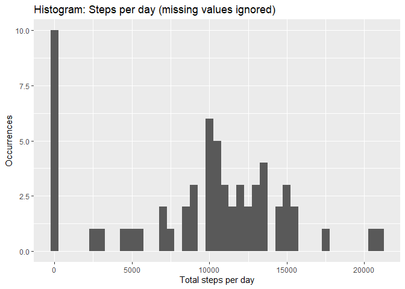
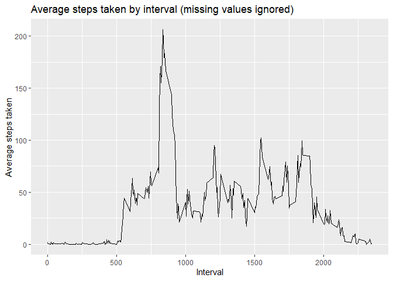
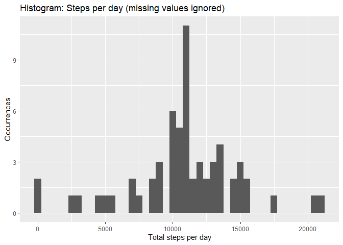
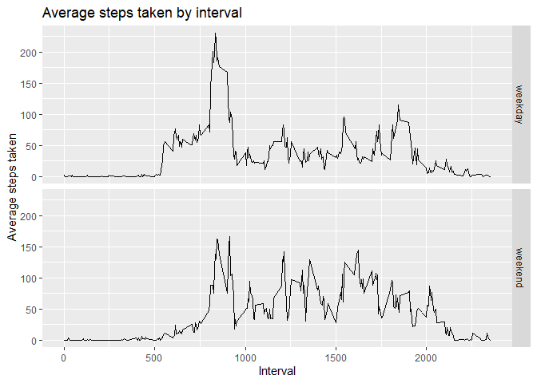

## Loading and preprocessing the data
Data is present in a file inside the root folder for the repository: 
*activity.zip*
### Unzipping
First step should be the unzipping of the file, finding then a csv file. For the
sake of efficiency, unzipping will only happen when no csv file is present.

```r
if (file.exists("activity.zip")) {
    if (!file.exists("activity.csv")) {
        unzip(zipfile="activity.zip")
    }
}

if (file.exists("activity.csv")) {
    print("CSV File present")    
}
```

```
## [1] "CSV File present"
```

###CSV load
In second place, data loading in a DataFrame called df

```r
df<-read.csv("activity.csv")
#summary(df)
```

###Processing
Process data: conversion for the date and including a new weekpart column with
the factor "weekend","weekday"

```r
library(dplyr)
```

```
## 
## Attaching package: 'dplyr'
```

```
## The following objects are masked from 'package:stats':
## 
##     filter, lag
```

```
## The following objects are masked from 'package:base':
## 
##     intersect, setdiff, setequal, union
```

```r
#transform the date character into date col
#add weekday
df<-df %>% mutate(date=as.Date(date))

#summary(df)
```


## What is mean total number of steps taken per day?
For every observation, we have the number of steps taken in the last five 
minutes of the day. This five minutes period is the interval. 
Then, we can use
the column date as group-by column and apply a SUM of the indicator steps.
With the calculation, we can plot an histogram to watch distribution over total
steps taken every day.

```r
library(ggplot2)
#group_by date, then sum steps
df_steps_per_day<-df %>% group_by(date) %>% summarise(steps_per_day=sum(steps,na.rm=TRUE),.groups="drop")
#plot:
myplot<-ggplot(data=df_steps_per_day)+
  aes(steps_per_day)+
  geom_histogram(na.rm=TRUE,binwidth=500)+
  xlab("Total steps per day")+
  ylab("Occurrences")+
  ggtitle("Histogram: Steps per day (missing values ignored)")
print(myplot)
```

<!-- -->

```r
#for the temporary result, calculate the mean
mean_steps_per_day<-mean(df_steps_per_day$steps_per_day, na.rm=TRUE)
median_steps_per_day<-median(df_steps_per_day$steps_per_day, na.rm=TRUE)
```
For this result, apply a mean
The **mean** for the total steps taken per day is **9354.23**


## What is the average daily activity pattern?
We are calculating the average daily activity pattern, whichi is again the mean
but considering the group on the interval, so for each one we can get the mean
inside the interval.
Please find below the time series for the data:

```r
#group by to prepare data
df_daily_pattern<-df %>% 
      group_by(interval) %>% 
      summarise(avg_steps_taken=mean(steps,na.rm=TRUE),.groups="drop")

#plot a line chart
myplot<-ggplot(data=df_daily_pattern)+
  aes(x=interval,y=avg_steps_taken)+
  geom_line(na.rm=TRUE)+
  xlab("Interval")+
  ylab("Average steps taken")+
  ggtitle("Average steps taken by interval (missing values ignored)")
print(myplot)
```

<!-- -->

```r
#calculation of max value: arrange the dataframe and taking the first column
better_interval_by_steps<-arrange(df_daily_pattern,desc(avg_steps_taken))[1,1]
```

The best interval in terms of average steps taken is **835**.


## Imputing missing values
In this section, we need to clarify situation with missing data.

```r
total_rows<-nrow(df)
missing_rows<-sum(is.na(df$steps))
```
For a total of **17568** rows in our dataset, we found **2304** 
are missing values (13.11 %)

For any missing value (please note that missing value is NA while 0 is a non-missing value) we will substitute the vaue
for the correspondant interval average for all dates.
So we assign internally the mean through a merge and set this mean value when NA is found.

```r
#First df and df_daily_pattern are merged by interval
#Then, steps is recalculated: if steps is NA, then avg_steps_taken. Else no change
df_clean<-mutate(
    merge(x=df,y=df_daily_pattern,by.x="interval",by.y="interval"),
    steps=ifelse(is.na(steps),avg_steps_taken,steps)
    )
#To avoid errors, last column to be deleted
df_clean$avg_steps_taken<-NULL

#summary(df_clean)
```

With the new dataset, we can update the histogram showing steps taken per day.

```r
#group_by date, then sum steps
df_steps_per_day_clean<-df_clean %>% group_by(date) %>% summarise(steps_per_day=sum(steps,na.rm=TRUE),.groups="drop")
#plot:
myplot<-ggplot(data=df_steps_per_day_clean)+
  aes(steps_per_day)+
  geom_histogram(na.rm=TRUE,binwidth=500)+
  xlab("Total steps per day")+
  ylab("Occurrences")+
  ggtitle("Histogram: Steps per day (missing values ignored)")
print(myplot)
```

<!-- -->

```r
#for the temporary result, calculate the mean and median
mean_steps_per_day_clean<-mean(df_steps_per_day_clean$steps_per_day, na.rm=TRUE)
median_steps_per_day_clean<-median(df_steps_per_day_clean$steps_per_day, na.rm=TRUE)
```
Now, if we recalculate the mean and the median, we found this new values:
The **mean** for the total steps taken per day is **10766.19** while before was **9354.23**  
The **median** for the total steps taken per day is **10766.19** while before was **10395** 

## Are there differences in activity patterns between weekdays and weekends?
Finally, we are going to analyze information based on factor that classifies each date 
following if it is in a weekend or not.

```r
#add weekdate
df_clean$weekpart <- factor(
  ifelse(strftime(df_clean$date,"%w")=="0","weekend",
         ifelse(strftime(df_clean$date,"%w")=="6","weekend","weekday")))
```
This new variable can be helpful to check differences between usual labour days and weekends

```r
#group by to prepare data
df_daily_pattern_clean<-df_clean %>% 
      group_by(interval,weekpart) %>% 
      summarise(avg_steps_taken=mean(steps,na.rm=TRUE),.groups="drop")

#plot a line chart
myplot<-ggplot(data=df_daily_pattern_clean)+
  aes(x=interval,y=avg_steps_taken)+
  geom_line(na.rm=TRUE)+
  facet_grid(weekpart ~ .)+
  xlab("Interval")+
  ylab("Average steps taken")+
  ggtitle("Average steps taken by interval")
print(myplot)
```

<!-- -->
  
The plots show that in weekday there are more steps, specially in the morning.

